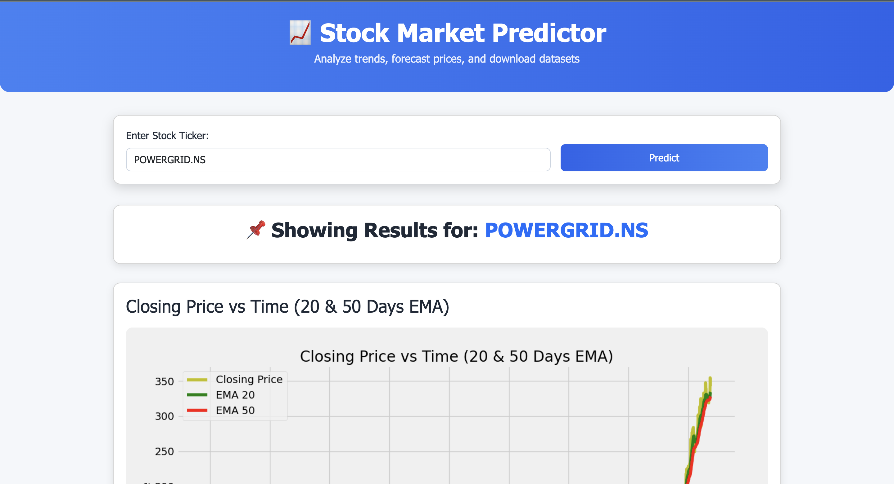
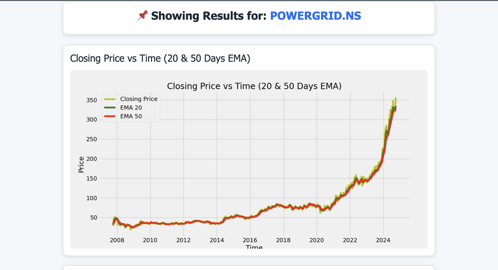
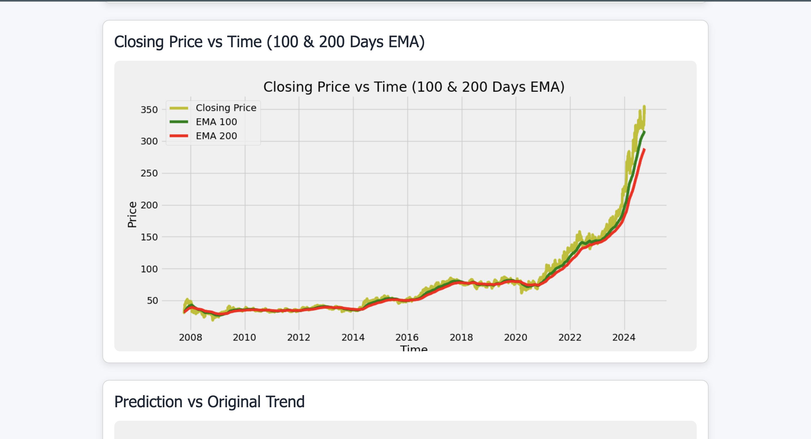
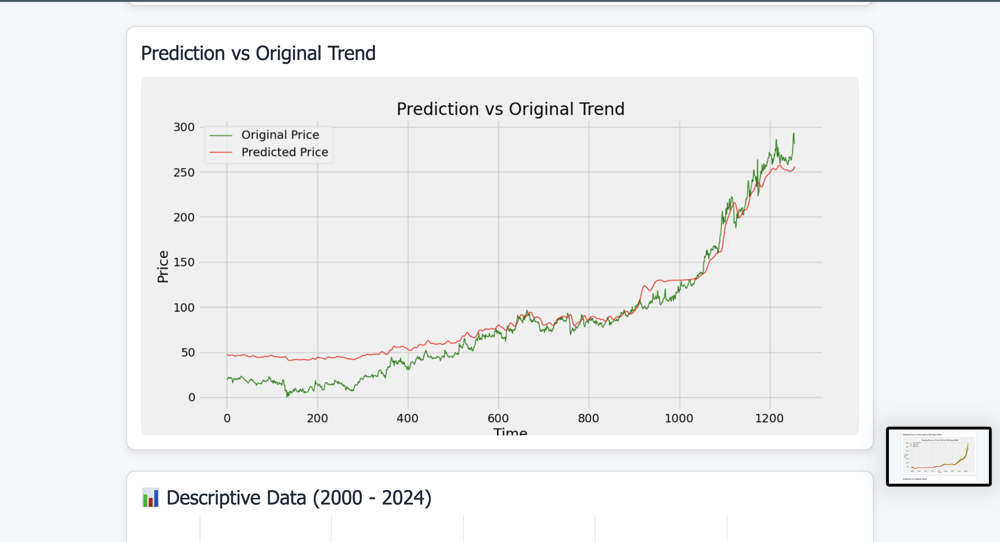
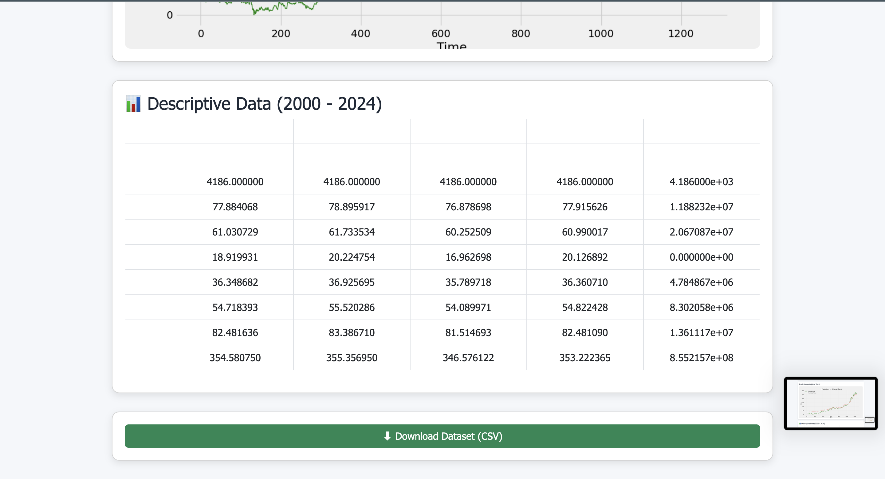

# 📈 Stock Market Predictor

A **web-based stock market prediction application** using an **LSTM (Long Short-Term Memory) deep learning model**. This tool allows users to predict stock prices, visualize trends, and download historical datasets. Built with **Python, Flask, and Matplotlib/Plotly**.

---

## 🚀 Features

- Predict stock prices using an **LSTM deep learning model**.
- Interactive and professional web interface using **Flask + Bootstrap**.
- Visualize:
  - Closing Price vs Time (20 & 50 Days EMA)
  - Closing Price vs Time (100 & 200 Days EMA)
  - Predicted vs Original Stock Price Trend
- Download historical stock data as CSV.
- Handles invalid or missing tickers gracefully.
- Default stock: `POWERGRID.NS`, but supports any valid stock ticker.

---

## 🛠️ Technologies Used

- **Python 3.11**
- **Flask** – Web framework for serving the app
- **Pandas, NumPy** – Data manipulation
- **Matplotlib** – Plotting charts
- **Keras (TensorFlow backend)** – LSTM model
- **yfinance** – Fetch historical stock data
- **Scikit-learn** – Data preprocessing (MinMaxScaler)
- **Bootstrap 5** – Frontend UI styling

---

---

## ⚡ Installation

### 1. Clone the repository

```bash
git clone https://github.com/your-username/Stock-Market-Predictor.git
cd Stock-Market-Predictor
code .
```

```bash
conda create -n stockenv python=3.11 -y
conda activate stockenv
```

```bash
pip install -r requirements.txt
```

## 🏃 Running the App
- Make sure your LSTM model (stock_dl_model.h5) is inside the Research/ folder.
- Run the Flask app:
```bash
python app.py
```
- Open your browser and go to:
http://127.0.0.1:5000

- Enter a stock ticker (e.g., POWERGRID.NS, AAPL, GC=F for Gold Futures) and click Predict.


## 🔍 How it Works
-User enters a stock ticker.
-App fetches historical data using yfinance.
-Data is split into training (70%) and testing (30%) sets.
-Closing prices are scaled using MinMaxScaler.
-LSTM model predicts the stock prices based on past 100 days data.
-Predictions are plotted and compared with original stock prices.
-Charts and CSV files are saved in the static/ folder and displayed on the web page.

## 📈 Charts
-EMA 20 & 50 Days: Shows short-term and mid-term trends.
-EMA 100 & 200 Days: Shows long-term trends.
-Prediction vs Original Price: Compares model predictions with actual stock prices.

## 🖼️ Screenshots

### Screenshot 1


### Screenshot 2


### Screenshot 3


### Screenshot 4


### Screenshot 5



## 👨‍💻 Author
- **Akshat Pratap Singh**
- **GitHub:** https://github.com/Akshat48002/Stock-Market-Predictor.git
- **Email:** akshatpratapsingh482002@gmail.com 